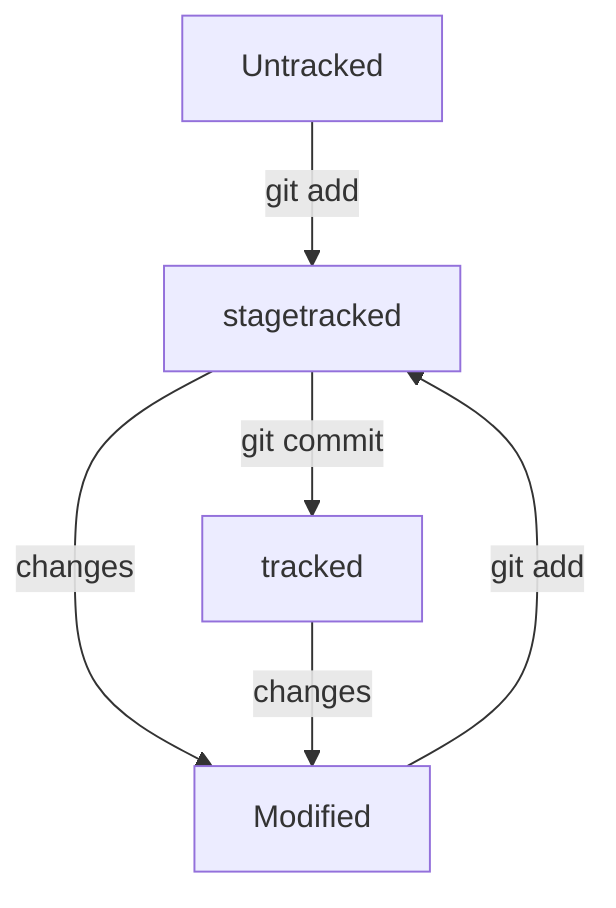

# Привет 
## Это мой первый _публичный_ файл 
### Здесь шпаргалка по первому контакту с Git 

---

## Создание репозитория и синхрон с GitHub

1. **_mkdir second-project_** (от англ. **_make directory, «создать директорию»_**) — создай папку с именем first-project в текущей папке.
2. **_git init_** сделать папку репозиторием
3. **_touch index.html (англ. touch, «коснуться»)_** — создай файл index.html в текущей папке
4. **_git add_** Подготовить файлы к сохранению
5. **_git commit -m 'Мой первый коммит!'_** Выполнить коммит
6. **_ls -la .ssh/_** проверить список SSH ключей
7. Если нет - **_ssh-keygen -t ed25519 -C "электронная почта, к которой привязан ваш аккаунт на GitHub"_**
8. > Enter a file in which to save the key (C:\Users\<имя_пользователя>\.ssh\):*_[Press enter]_*
9. **_ls -a ~/.ssh_* проверить список SSH ключей, _можно трогать только с расширением .pub!_
10. **_clip < ~/.ssh/id_ed25519.pub_**  скопировать содержимое ключа в буфер обмена
11. На GitHub во вкладке нужного проекта выбрать настройки => Deploy keys => Add deploy key => **вставить из пункта выше информацию** (РАЗРЕШИТЬ РЕДАКТИРОВАНИЕ! ГАЛОЧКА!)
12. Перейдите на страницу удалённого репозитория, выберите тип SSH и **скопируйте URL**
13. В нужной папке (проверить pwd) прописать **_git remote add origin _git@github.com:%ИМЯ_АККАУНТА%/first-project.git _(вставить с github)_** #вставить на Windows Ctrl+Shift+V или правой кнопкой мыши
14. Убедиться, что репозитории связаны — **_git remote -v_**
15. Вы уже прошли весь «цикл коммита»: 
* подготовили файлы с помощью git add
* закоммитили их с комментарием командой git commit -m. 
* загрузить содержимое локального репозитория на GitHub - команда **_git push_** 
	В первый раз эту команду нужно вызвать с флагом -u и параметрами origin (имя удалённого репозитория) и main или master (название текущей ветки). 
	Флаг -u свяжет локальную ветку с одноимённой удалённой.

---

## Хэш, лог

1. Хеширование (от англ. hash, «рубить», «крошить», «мешанина») — это способ преобразовать набор данных и получить их «отпечаток» (англ. fingerprint).
2. Информация о коммите — это набор данных: когда был сделан коммит, содержимое файлов в репозитории на момент коммита и ссылка на предыдущий, или родительский (англ. parent), коммит.
3. Git хеширует (преобразует) информацию о коммите с помощью алгоритма SHA-1 (от англ. Secure Hash Algorithm — «безопасный алгоритм хеширования») и получает для каждого коммита свой уникальный хеш — результат хеширования.
4. Обычно хеш — это короткая (4040 символов в случае SHA-1) строка, которая состоит из цифр 0—90—9 и латинских букв 𝐴—𝐹A—F (неважно, заглавных или строчных). Она обладает следующими важными свойствами:
·	если хеш получить дважды для одного и того же набора входных данных, то результат будет гарантированно одинаковый;
·	если хоть что-то в исходных данных поменяется (хотя бы один символ), то хеш тоже изменится (причём сильно).
5. Git хранит таблицу соответствий хеш → информация о коммите. Если вы знаете хеш, вы можете узнать всё остальное: автора и дату коммита и содержимое закоммиченных файлов. Можно сказать, что хеш — основной идентификатор коммита.
6. Все хеши и таблицу хеш → информация о коммите Git сохраняет в служебные файлы. Они находятся в скрытой папке .git в репозитории проекта.
7. После вызова git log появляется список коммитов.
8. Получить сокращённый лог — git log --oneline
9. Файл HEAD (англ. «голова», «головной») — один из служебных файлов папки .git. Он указывает на коммит, который сделан последним (то есть на самый новый).
	В этом можно убедиться с помощью терминала. Перейдите в папку .git командой cd. Посмотрите содержимое файла HEAD командой cat.
	Внутри HEAD — ссылка на служебный файл: refs/heads/master (или refs/heads/main в зависимости от названия ветки). Если заглянуть в этот файл, можно увидеть хеш последнего коммита.
	Когда вы делаете коммит, Git обновляет refs/heads/master — записывает в него хеш последнего коммита. Получается, что HEAD тоже обновляется, так как ссылается на refs/heads/master.
10. Почему при команде git init у меня не создалась папка .git? Эта папка скрыта. Проверьте в настройках проводника включен ли режим просмотра скрытых папок

---

## Статусы

# Вуаля, вы восхитительны! 

 

